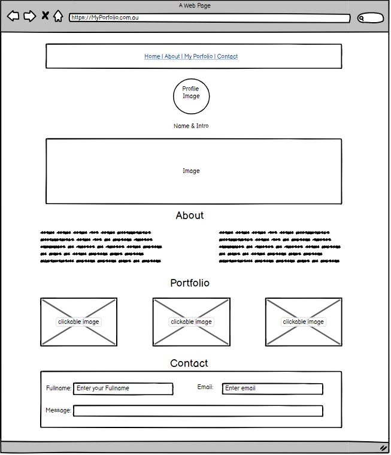

# Project: Responsive Brochure Site
- Due Saturday by 11:59pm 
- Submitting a website url
- Deploying via Surge

# Problem Statement
You've been learning HTML and CSS over the previous lessons. You've been receiving specific guidance ("Use a <link> tag!") and have been steered by our documentation or tests. In effort to help you build your confidence, we're going to give you nothing except some specifications and leave the document structure and styling to you. It's time to tie all your learning together into one project. You must create....

...a brochure site!

When the first web sites started to appear in the mid-nineties, brochure sites were the only sites on the web. They were called brochure sites because, well, like brochures they provided static text and images, contact information, a few divisions, and had a certain style.

# Learning Objectives
- Build a brochure site

# Requirements
- Your site must use HTML5 semantic elements for grouping content e.g. header, article, and aside.
- Your HTML must pass validation
- Your CSS must pass validation
- Your site must use one of these layout: multicolumn with floats, flexbox, or CSS grid.
- You must include at least 3 images
- Deploy your site to web hosting
- Your site must be optimized for at least 2 viewports (a full-screen device as well as a mobile device).

# Language
- HTML
- CSS 

# Wireframe
- initial idea 

#### Completed work: http://toothsome-grape.surge.sh/ 
